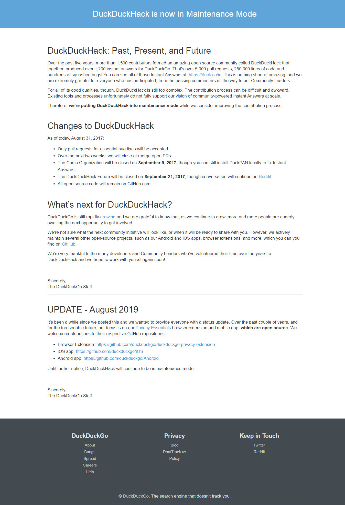

# ddh_copy

This is a copy of *[duckduckhack](https://duckduckhack.com)* **maintanance mode** website.

This is a practice repo, making a duplication of a website.  

This duckduckhack website is now in maintanance mode. This looked simple and easy for my practice. 

So the website may change later. The ful-size screenshot of the website when I worked on it is here.

The replica I made is [this](https://krishnamodepalli.github.io/ddh_copy/). 
> Disclaimer: **My replica works good on desktop view.**

